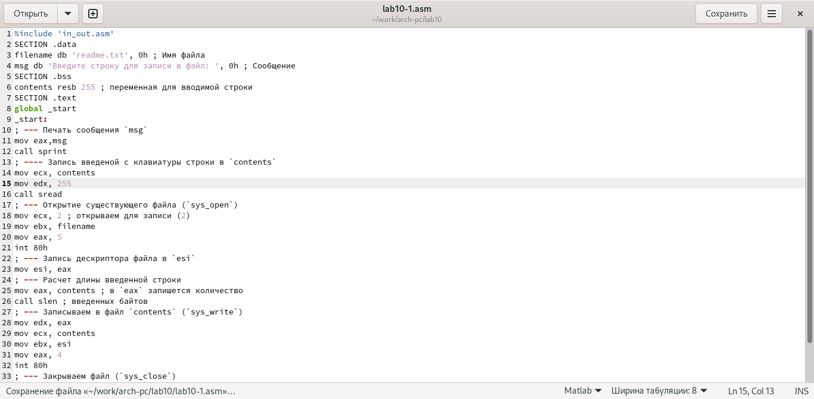
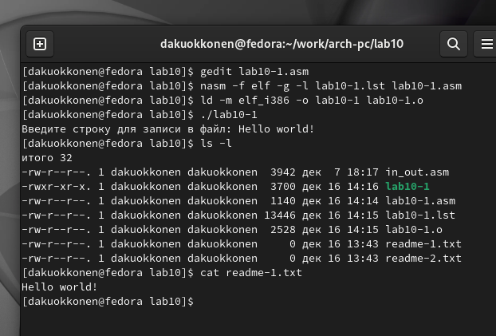
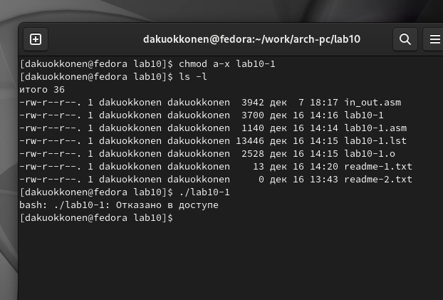
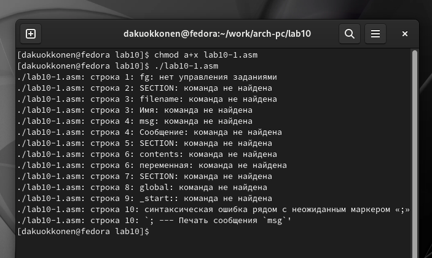
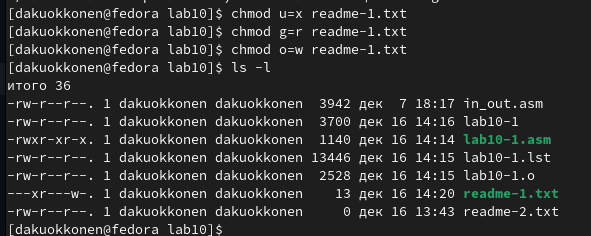
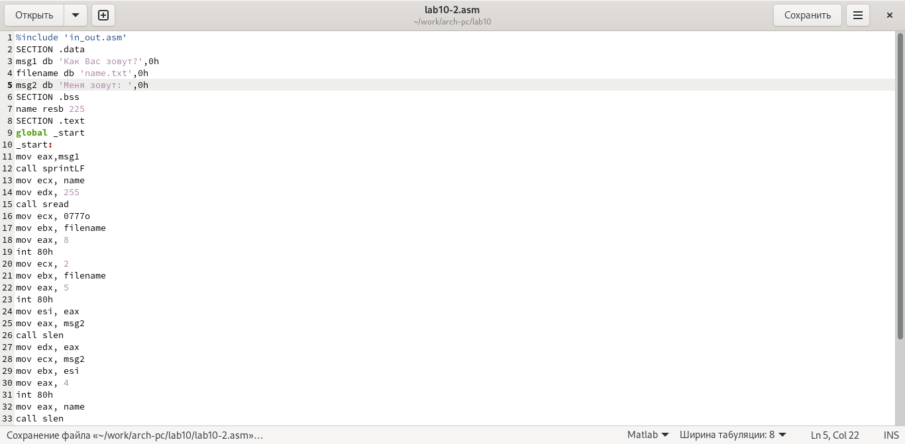
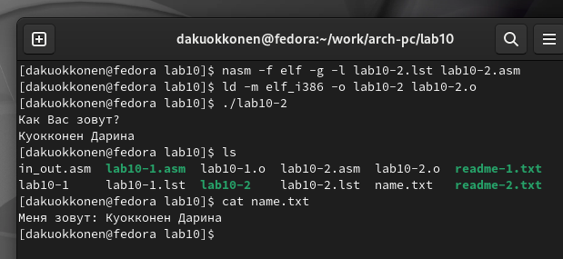

---
## Front matter
title: "Отчёт по лабораторной работе №10"
subtitle: "Дисциплина: Архитектура Компьютера"
author: "Дарина Андреевна Куокконен"

## Generic otions
lang: ru-RU
toc-title: "Содержание"

## Bibliography
bibliography: bib/cite.bib
csl: pandoc/csl/gost-r-7-0-5-2008-numeric.csl

## Pdf output format
toc: true # Table of contents
toc-depth: 2
lof: true # List of figures

fontsize: 12pt
linestretch: 1.5
papersize: a4
documentclass: scrreprt
## I18n polyglossia
polyglossia-lang:
  name: russian
  options:
	- spelling=modern
	- babelshorthands=true
polyglossia-otherlangs:
  name: english
## I18n babel
babel-lang: russian
babel-otherlangs: english
## Fonts
mainfont: PT Serif
romanfont: PT Serif
sansfont: PT Sans
monofont: PT Mono
mainfontoptions: Ligatures=TeX
romanfontoptions: Ligatures=TeX
sansfontoptions: Ligatures=TeX,Scale=MatchLowercase
monofontoptions: Scale=MatchLowercase,Scale=0.9
## Biblatex
biblatex: true
biblio-style: "gost-numeric"
biblatexoptions:
  - parentracker=true
  - backend=biber
  - hyperref=auto
  - language=auto
  - autolang=other*
  - citestyle=gost-numeric
## Pandoc-crossref LaTeX customization
figureTitle: "Рис."
tableTitle: "Таблица"
listingTitle: "Листинг"
lofTitle: "Список иллюстраций"

lolTitle: "Листинги"
## Misc options
indent: true
header-includes:
  - \usepackage{indentfirst}
  - \usepackage{float} # keep figures where there are in the text
  - \floatplacement{figure}{H} # keep figures where there are in the text
---

# Цель работы

Цель данной работы - это приобретение практического опыта в написании программ для работы с файлами.

# Задание

	1. Работа с файлами средствами NASM.
	2. Выполнение заданий для самостоятельной работы
	
# Теоретическое введение

 ОС GNU/Linux является многопользовательской операционной системой. И для обеспечения защиты данных одного пользователя от действий других пользователей существуют специальные механизмы разграничения доступа к файлам. Кроме ограничения доступа, данный механизм позволяет разрешить другим пользователям доступ данным для совместной
работы. Права доступа определяют набор действий (чтение, запись, выполнение), разрешённых для выполнения пользователям системы над файлами. Для каждого файла пользователь может входить в одну из трех групп:

владелец, член группы владельца, все остальные. 

Для каждой из этих групп может быть установлен свой набор прав доступа. Владельцем файла является его создатель. Набор прав доступа задается тройками битов и состоит из прав на чтение, запись и исполнение файла. В символьном представлении он имеет вид строк rwx, где вместо любого символа может стоять дефис.  Буква означает наличие права (установлен в единицу второй бит триады r — чтение, первый бит w — запись, нулевой бит х — исполнение), а дефис означает отсутствие права (нулевое значение соответствующего бита). Также права доступа могут быть представлены как восьмеричное число. Так, права доступа rw- (чтение и запись, без исполнения) понимаются как три двоичные цифры 110 или как восьмеричная цифра 6. Тип файла определяется первой позицией, это может быть: каталог — d, обычный файл — дефис (-) или символьная ссылка на другой файл — l. Следующие 3 набора по 3 символа определяют конкретные права для конкретных групп: r — разрешено чтение файла, w — разрешена запись в файл; x — разрешено исполнение файл и дефис (-) — право не дано. 

Для изменения прав доступа служит команда chmod, которая понимает как символьное, так и числовое указание прав. Для того чтобы назначить файлу /home/debugger/README права rw-r, то есть разрешить владельцу чтение и запись, группе только чтение, остальным пользователям — ничего. B  символьном представлении есть возможность явно указывать какой группе какие права необходимо добавить, отнять или присвоить. В операционной системе Linux существуют различные методы управления файлами, например, такие как создание и открытие файла, только для чтения или для чтения и записи, добавления в существующий файл, закрытия и удаления файла, предоставление прав доступа. Обработка файлов в операционной системе Linux осуществляется за счет использования определенных системных вызовов. Для корректной работы и доступа к файлу при его открытии или создании, файлу присваивается уникальный номер (16-битное целое число) – дескриптор файла. Для создания и открытия файла служит системный вызов sys_creat, который использует следующие аргументы: права доступа к файлу в регистре ECX, имя файла в EBX и номер системного вызова sys_creat (8) в EAX. Для открытия существующего файла служит системный вызов sys_open, который использует следующие аргументы: права доступа к файлу в регистре EDX, режим доступа к файлу в регистр ECX, имя файла в EBX и номер системного вызова sys_open (5) в EAX. Для записи в файл служит системный вызов sys_write, который использует следующие аргументы: количество байтов для записи в регистре EDX, строку содержимого для записи ECX, файловый дескриптор в EBX и номер системного вызова sys_write (4) в EAX.

Системный вызов возвращает фактическое количество записанных байтов в регистр EAX. В случае ошибки, код ошибки также будет находиться в регистре EAX. прежде чем записывать в файл, его необходимо создать или открыть, что позволит получить дескриптор файла.

# Выполнение лабораторной работы
 
 **4.1) Работа с файлами средствами NASM.**
 
 С помощью утилиты *mkdir* создаю директорию lab10 для выполнения соответствующей лабораторной работы. Перехожу в созданный каталог с помощью утилиты *cd*. С помощью *touch* создаю файл lab10-1.asm. Открываю созданный файл lab10-1.asm.(рис. @fig:001).

{#fig:001 width=70%}

 Вставляю в него следующую программу: (рис. @fig:002).
 
{#fig:002 width=70%}

  Создаю исполняемый файл и проверяю его работу. (рис. @fig:003).

{#fig:003 width=70%}

 Далее, с помощью команды *chmod а-х* изменяю права доступа к исполяемому файлу, запретив его выполнение, далее проверяю его работу. (рис. @fig:004).
 
{#fig:004 width=70%}
 
 Файл не исполняется, все верно. Далее я с помощью команды *chmod a+x* добавляю права на исполнение самого файла lab10-1.asm и пытаюсь выполнить его.  (рис. @fig:005).

{#fig:005 width=70%}
 
 Текстовый файл начинает работу, но не исполняется, так как не содержит в себе команд для терминала. Затем в соответствии со своим 11-м вариантом, я изменяю права доступа к файлу readme-1.txt согласно таблице. И проверяю правильность выполнение команды с помощью *ls -l*. (рис. @fig:006).
 
{#fig:006 width=70%}

 Аналогично поступаю с  файлом readme-2.txt, только уже в числовом виде. (рис. @fig:007).

{#fig:007 width=70%}

 **4.2) Выполнение заданий для самостоятельной работы.**

 Создаю файлы lab10-2.asm и name.txt для корректной работы программы записи моего имени, введенного с клавиатуры, в соответвующий файл. Затем, я пишу сам код: (рис. @fig:007).
 
{#fig:008 width=70%}
 
 Создаю исполняемый файл, проверяю его работу, далее ввожу необходимые команды, и убеждаюсь в правильности работы программы. (рис. @fig:009).
 
{#fig:009 width=70%}

 Листинг 4.1 - Программа, приглашающая написать имя, и записывающая его в файл.
 
 
 
```NASM
%include 'in_out.asm'
SECTION .data
msg1 db 'Как Вас зовут?',0h
filename db 'name.txt',0h
msg2 db 'Меня зовут: ',0h
SECTION .bss
name resb 225
SECTION .text
global _start
_start:
mov eax,msg1
call sprintLF
mov ecx, name
mov edx, 255
call sread 
mov ecx, 0777o
mov ebx, filename
mov eax, 8
int 80h
mov ecx, 2
mov ebx, filename 
mov eax, 5
int 80h
mov esi, eax
mov eax, msg2
call slen
mov edx, eax 
mov ecx, msg2
mov ebx, esi
mov eax, 4
int 80h
mov eax, name
call slen
mov edx, eax 
mov ecx, name 
mov ebx, esi
mov eax, 4
int 80h
mov ebx, esi
mov eax, 6
int 80h
call quit
```


# Выводы

 При выполнении данной лабораторной работы, я приобрела практический опыт в написании программ с использованием циклов и обработкой аргументов командной строки.
 
# Список литературы{.unnumbered}

[Архитектура компьютера и ЭВМ](https://esystem.rudn.ru/pluginfile.php/2089097/mod_resource/content/0/Лабораторная%20работа%20№10.%20Работа%20с%20файлами%20средствами%20Nasm.pdf)
